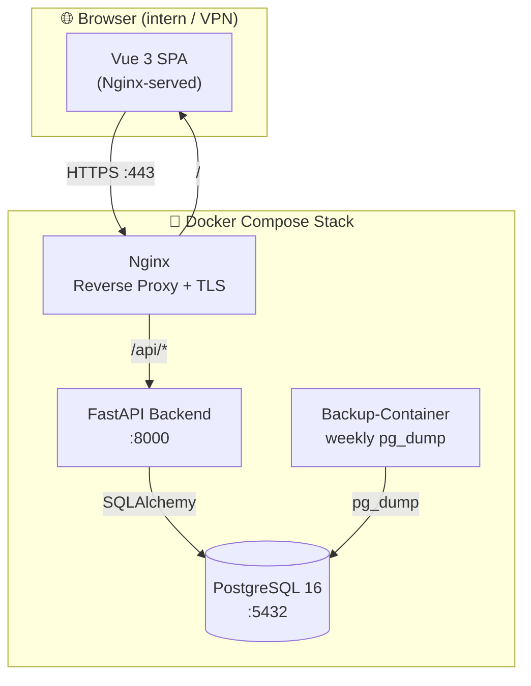
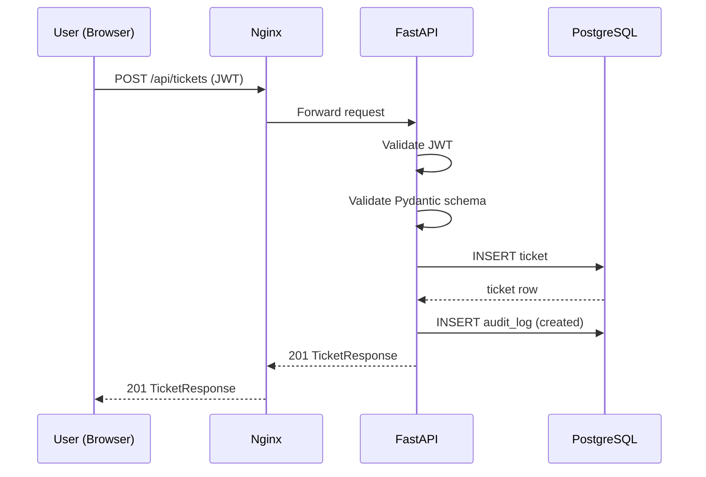
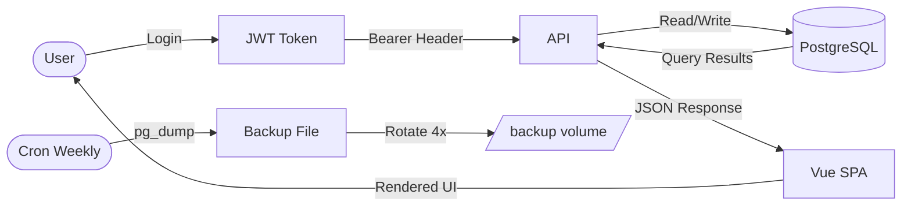
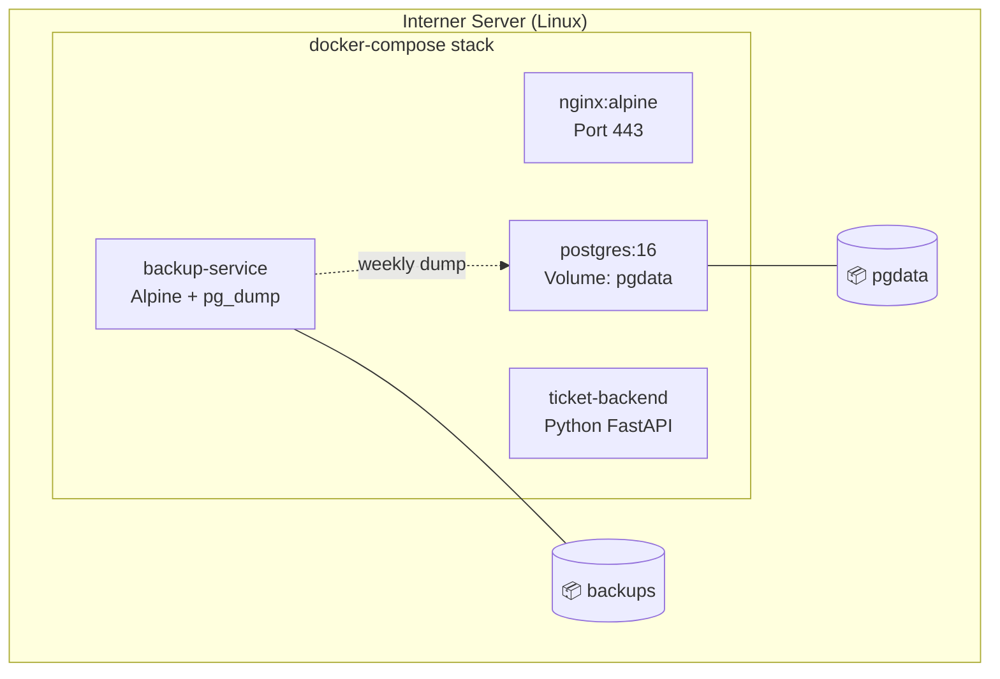

# Ticket-Tool — Architecture Plan

**Version**: 1.0 | **Date**: 2026-04-18 | **Status**: Planned  
**Agent**: project-architecture-planner + principal-software-engineer

---

## Executive Summary

Das Ticket-Tool ist eine interne, browserbasierte Webanwendung zur Kanban-basierten Aufgabenverwaltung für kleine Teams. Die Architektur folgt einem klassischen **Monolith mit klar getrennten Schichten** (API-Backend + SPA-Frontend), containerisiert via Docker, betrieben intern im Firmennetz/VPN. Kein Cloud-Deployment, keine externen APIs im MVP.

---

## Discovery Summary

| Dimension | Wert |
|-----------|------|
| Nutzer | Kleines internes Team + 1 Admin |
| Zugriff | Firmennetz / VPN only |
| Scale | <100 gleichzeitige Nutzer |
| Deployment | Docker auf internem Server |
| Compliance | Interne Nutzung, kein personenbezogener Datentransfer extern |
| Browser | Chrome, Edge, Firefox (Desktop only) |
| Sprachen | Deutsch / Englisch (umschaltbar) |

---

## Architecture Style

**Gewählt: Modularer Monolith mit dedizierter Datenbankschicht**

| Option | Bewertung |
|--------|-----------|
| ✅ Modularer Monolith (gewählt) | Passt zu kleinem Team, MVP-Scope, einfachem Deployment |
| ❌ Microservices | Overengineering für diesen Use Case |
| ❌ Serverless | Kein Cloud-Deployment vorgesehen |

Rationale: Einfachheit, Wartbarkeit, passt zum Team. Klar getrennte Module (Tickets, Users, Admin, Auth) ermöglichen spätere Extraktion ohne kompletten Umbau.

---

## Technology Stack

### Frontend

| Layer | Primär | Alternativ | Begründung |
|-------|--------|-----------|------------|
| Framework | **Vue 3** | React 18 | Geringere Komplexität, gute DX, Vuedraggable für Kanban |
| Language | **TypeScript** | — | Typsicherheit, bessere Wartbarkeit |
| Build | **Vite** | — | Schnell, moderner Standard |
| State | **Pinia** | Vuex | Einfacher, Vue-3-nativ |
| Router | **Vue Router 4** | — | Standard |
| Drag & Drop | **vue-draggable-next** | — | Kanban-Board |
| HTTP | **Axios** | fetch | Interceptors für Auth-Header |
| i18n | **vue-i18n** | — | DE/EN Umschaltung |
| CSS | **Tailwind CSS** | — | Schnelles, konsistentes Styling |

### Backend

| Layer | Primär | Alternativ | Begründung |
|-------|--------|-----------|------------|
| Framework | **FastAPI (Python)** | Express.js | Async, autom. OpenAPI-Docs, typsicher |
| Language | **Python 3.12** | Node.js | Team-Expertise, schnelle Entwicklung |
| ORM | **SQLAlchemy 2.0** | — | Leistungsfähig, Alembic-Integration |
| Migrations | **Alembic** | — | Standard für SQLAlchemy |
| Auth | **python-jose (JWT)** | — | Stateless Sessions |
| Passwort | **passlib[bcrypt]** | argon2 | Bewährter Standard |
| Validation | **Pydantic v2** | — | Integriert in FastAPI |

### Datenbank

| Layer | Primär | Begründung |
|-------|--------|-----------|
| RDBMS | **PostgreSQL 16** | Robust, JSON-Support, bewährt |
| Backup | **pg_dump** via Cron | Einfach, zuverlässig |

### Infrastruktur

| Komponente | Technologie |
|------------|------------|
| Containerisierung | Docker + Docker Compose |
| Reverse Proxy / SSL | Nginx (internes TLS-Zertifikat) |
| CI/CD | GitHub Actions |
| Secrets | Docker Secrets / .env (nicht eingecheckt) |

---

## System Architecture



### Komponentendiagramm

```mermaid
graph LR
    subgraph Frontend["Vue 3 SPA"]
        KB[KanbanBoard]
        TD[TicketDetail]
        ADM[AdminPanel]
        AUTH[LoginPage]
        REP[ReportView]
    end

    subgraph Backend["FastAPI"]
        subgraph Routers
            AR[/auth]
            TR[/tickets]
            UR[/users]
            CR[/categories]
            TYR[/types]
            RR[/reports]
            CMR[/comments]
        end
        subgraph Services
            AS[AuthService]
            TS[TicketService]
            US[UserService]
            AUS[AuditService]
        end
        subgraph Models
            UM[UserModel]
            TM[TicketModel]
            CM[CommentModel]
            CAT[CategoryModel]
            TYM[TypeModel]
            AUD[AuditLogModel]
        end
    end

    KB --> TR
    TD --> TR
    TD --> CMR
    ADM --> UR
    ADM --> CR
    ADM --> TYR
    AUTH --> AR
    REP --> RR

    AR --> AS
    TR --> TS
    TS --> AUS
    TS --> TM
    US --> UM
```

### Datenfluss Ticket-Erstellung



---

## Data Flow Diagram



---

## Deployment Diagram



---

## Scalability Roadmap

### Phase A — MVP (aktuell, <50 Nutzer)
- Single Docker-Compose Stack auf 1 Host
- SQLite wäre möglich, aber PostgreSQL für Erweiterbarkeit
- Nginx served Frontend + Reverse-Proxy

### Phase B — Wachstum (50–500 Nutzer, optional)
- Read Replicas für PostgreSQL
- Caching Layer (Redis) für Session/Token Blacklist
- Horizontale Skalierung des Backends via mehrere Container

### Phase C — Enterprise (>500 Nutzer, Out of Scope MVP)
- Kubernetes Deployment
- Managed DB (z.B. RDS/Cloud DB)
- E-Mail-Integration, SLA-Tracking

---

## Security Architecture

Siehe `docs/security/security-review.md` für vollständige Analyse.

Kurzübersicht:
- **Authentifizierung**: JWT (HS256), Access Token 60 min, kein Refresh Token im MVP
- **Passwörter**: bcrypt mit cost factor 12
- **Transport**: TLS via Nginx (internes Zertifikat)
- **Zugriff**: Nur intern / VPN
- **Audit**: Änderungsprotokoll auf DB-Ebene
- **Secrets**: via `.env` (nicht eingecheckt), Docker Secrets in Prod

---

## Architecture Decision Records

| ADR | Entscheidung | Status |
|-----|-------------|--------|
| ADR-001 | Vue 3 statt React | Accepted |
| ADR-002 | FastAPI statt Express | Accepted |
| ADR-003 | PostgreSQL statt MySQL | Accepted |
| ADR-004 | Monolith statt Microservices | Accepted |
| ADR-005 | JWT (stateless) statt Session-Cookies | Accepted |

Vollständige ADRs: `docs/architecture/adr/`

---

## Risks & Mitigations

| Risiko | Wahrscheinlichkeit | Impact | Mitigation |
|--------|--------------------|--------|-----------|
| JWT nicht widerrufbar (Logout) | Mittel | Niedrig | Kurze Token-Laufzeit (60 min) |
| Backup-Ausfall unbemerkt | Niedrig | Hoch | Backup-Monitoring im CI/CD |
| Nginx-Zertifikat abläuft | Mittel | Hoch | Zertifikat-Rotation dokumentieren |
| DB-Volume-Verlust | Sehr Niedrig | Kritisch | Regelmäßige Backups + Restore-Test |

---

## Next Steps

1. Repository-Struktur aufsetzen (→ repo-architect)
2. Backend-Grundstruktur mit FastAPI scaffolden
3. Datenbankmodelle + Alembic-Migrationen
4. Frontend-Grundstruktur mit Vue 3 + Vite
5. Docker-Compose-Setup (→ devops-expert)
6. CI/CD-Pipeline (→ devops-expert)
