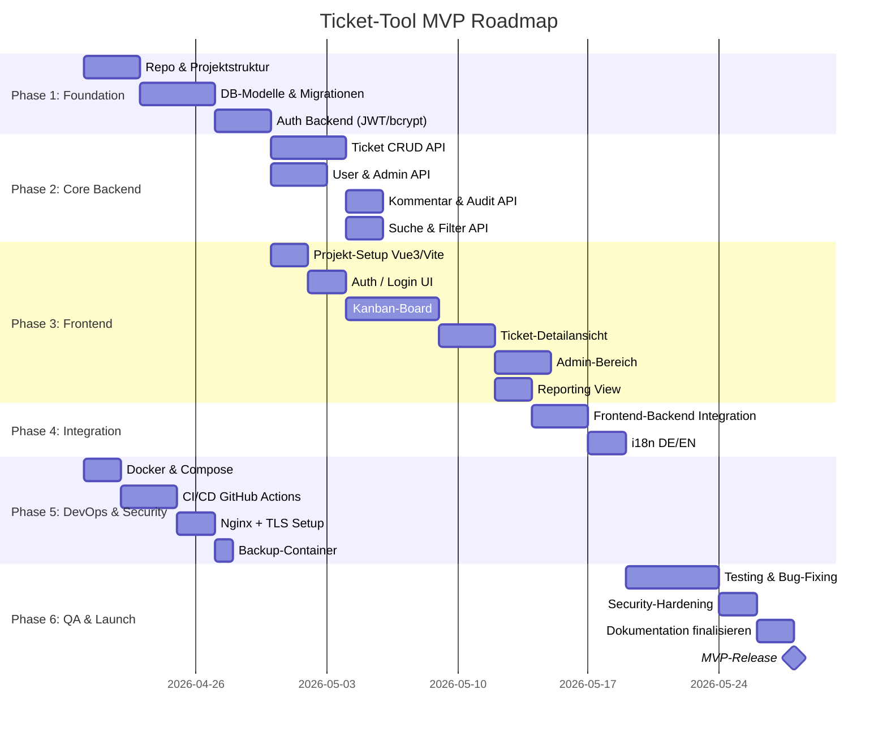

# Ticket-Tool MVP — Projektplan & Roadmap

**Agent**: plan + principal-software-engineer  
**Quelle**: Lastenheft Ticket-Tool v1.0, April 2026

---

## Übersicht

---

## Phasen & Meilensteine

### Phase 1: Foundation (Sprint 1, ~1,5 Wochen)

**Ziel**: Lauffähige Basis — Repo, Datenbankmodelle, Authentifizierung

| # | Task | Deliverable | Abhängigkeit |
|---|------|-------------|-------------|
| P1.1 | Repository-Struktur aufsetzen | Monorepo-Layout, `.gitignore`, `README.md` | — |
| P1.2 | Docker-Compose Dev-Stack | `docker-compose.dev.yml` mit DB + Backend | — |
| P1.3 | PostgreSQL-Schema + Alembic | `alembic/versions/001_initial.py` | P1.2 |
| P1.4 | SQLAlchemy-Modelle | `backend/app/models/*.py` | P1.3 |
| P1.5 | JWT-Auth (Login/Logout) | `POST /api/auth/login`, `POST /api/auth/logout` | P1.4 |
| P1.6 | Passwort-Hashing (bcrypt) | `AuthService.hash_password()`, `verify_password()` | P1.4 |

**Meilenstein M1**: ✅ Login funktioniert, DB-Modelle sind migriert

---

### Phase 2: Core Backend (Sprint 2, ~2 Wochen)

**Ziel**: Vollständige REST API für alle Domänenobjekte

| # | Task | Deliverable | Abhängigkeit |
|---|------|-------------|-------------|
| P2.1 | Ticket CRUD | `GET/POST/PUT/DELETE /api/tickets` | M1 |
| P2.2 | Ticket Statuswechsel | `PATCH /api/tickets/{id}/status` + Auto-Archivierung | P2.1 |
| P2.3 | Ticket Zuweisung | `PATCH /api/tickets/{id}/assign` | P2.1 |
| P2.4 | Kommentare | `GET/POST /api/tickets/{id}/comments` | P2.1 |
| P2.5 | Audit Log | AuditService, automatisch bei Status/Feldänderungen | P2.2 |
| P2.6 | Suche (Volltext) | `GET /api/tickets?search=...` | P2.1 |
| P2.7 | Filter | `GET /api/tickets?status=&priority=&assignee=...` | P2.1 |
| P2.8 | User Management (Admin) | `GET/POST/PUT /api/users` | M1 |
| P2.9 | Kategorien (Admin) | `GET/POST/PUT /api/categories` | M1 |
| P2.10 | Typen (Admin) | `GET/POST/PUT /api/types` | M1 |
| P2.11 | Reporting | `GET /api/reports/by-status`, `/by-assignee`, `/by-priority` | P2.1 |

**Meilenstein M2**: ✅ Vollständige API, getestet via Swagger UI

---

### Phase 3: Frontend (Sprint 2–3, ~2,5 Wochen, parallel zu Backend)

**Ziel**: Vollständige Vue-3-SPA mit Kanban-Board

| # | Task | Deliverable | Abhängigkeit |
|---|------|-------------|-------------|
| P3.1 | Vue 3 + Vite + Tailwind Setup | `frontend/` Grundstruktur | — |
| P3.2 | Router + Pinia Store | `router/index.ts`, `stores/` | P3.1 |
| P3.3 | Axios-Interceptor (JWT) | `api/axios.ts` mit Auth-Header + 401-Handling | P3.2 |
| P3.4 | Login-Seite | `views/LoginView.vue` | P3.3 |
| P3.5 | Kanban-Board | `views/BoardView.vue` + `components/TicketCard.vue` | P3.4 |
| P3.6 | Drag & Drop (Statuswechsel) | vue-draggable-next Integration | P3.5 |
| P3.7 | Ticket-Detailansicht | `views/TicketDetailView.vue` | P3.5 |
| P3.8 | Ticket-Formular (Neu/Bearbeiten) | `components/TicketForm.vue` | P3.7 |
| P3.9 | Kommentar-Bereich | `components/CommentSection.vue` | P3.7 |
| P3.10 | Filterleiste | `components/FilterBar.vue` | P3.5 |
| P3.11 | Admin-Bereich | `views/AdminView.vue` + sub-views | P3.4 |
| P3.12 | Reporting-View | `views/ReportView.vue` | P3.5 |
| P3.13 | i18n DE/EN | `locales/de.json`, `locales/en.json`, Toggle | P3.4 |
| P3.14 | Telekom-MMS-Farbschema | `tailwind.config.ts` + globale Stile | P3.1 |

**Meilenstein M3**: ✅ SPA vollständig lauffähig gegen lokale API

---

### Phase 4: Integration & Feinschliff (Sprint 4, ~1 Woche)

| # | Task | Deliverable |
|---|------|-------------|
| P4.1 | End-to-End-Test aller User Flows | Manuelle Testprotokolle |
| P4.2 | Error Handling (API + UI) | Einheitliche Fehlermeldungen |
| P4.3 | Loading States & UX Polish | Spinner, Skeleton Loader |
| P4.4 | Reaktionszeit < 1s sicherstellen | Profiling, Indexe in DB |
| P4.5 | Barrierefreiheit (aria-Labels) | WCAG 2.1 AA basics |

**Meilenstein M4**: ✅ Integriertes System, alle Use Cases funktionieren

---

### Phase 5: DevOps & Security (parallel ab Tag 1)

| # | Task | Deliverable |
|---|------|-------------|
| P5.1 | Dev Docker-Compose | `docker-compose.dev.yml` |
| P5.2 | Prod Docker-Compose | `docker-compose.prod.yml` |
| P5.3 | Backend Dockerfile | `backend/Dockerfile` (multi-stage) |
| P5.4 | Frontend Dockerfile | `frontend/Dockerfile` (multi-stage) |
| P5.5 | Nginx-Konfiguration | `nginx/nginx.conf` + TLS |
| P5.6 | Backup-Service | `backup/backup.sh` + Cron |
| P5.7 | GitHub Actions CI | `.github/workflows/ci.yml` |
| P5.8 | GitHub Actions CD | `.github/workflows/cd.yml` |
| P5.9 | Security Hardening | Firewall-Regeln, HTTP-Headers |

**Meilenstein M5**: ✅ Produktions-Stack deployt, CI/CD grün

---

### Phase 6: QA & Release (Sprint 5, ~1 Woche)

| # | Task | Deliverable |
|---|------|-------------|
| P6.1 | Backend Unit Tests | `backend/tests/` (pytest) |
| P6.2 | Frontend Component Tests | `frontend/src/**/*.spec.ts` (Vitest) |
| P6.3 | Security Review | `docs/security/security-review.md` |
| P6.4 | Dokumentation finalisieren | README, Onboarding, Architektur |
| P6.5 | Abnahme-Test mit Team | Testprotokoll |
| P6.6 | MVP-Release (Tag erstellen) | `git tag v1.0.0` |

**Meilenstein M6**: ✅ MVP freigegeben, Team eingarbeitet

---

## Ressourcen & Verantwortlichkeiten

| Rolle | Verantwortung |
|-------|--------------|
| Backend-Entwickler | FastAPI, PostgreSQL, Auth, API |
| Frontend-Entwickler | Vue 3, Kanban-Board, UI |
| DevOps | Docker, CI/CD, Nginx, Backup |
| Admin/PO | Abnahme, User Stories, Lastenheft |

---

## Risikomatrix

| Risiko | Gegenmaßnahme |
|--------|--------------|
| Drag & Drop Performance bei vielen Karten | Virtuelles Scrolling, max. 50 Karten/Spalte |
| TLS-Zertifikat-Setup komplex intern | Früh starten, IT einbeziehen |
| i18n-Vollständigkeit | Translation-Keys sofort anlegen, nicht nachträglich |
| Backup nicht getestet | Restore-Test in Phase 6 obligatorisch |
